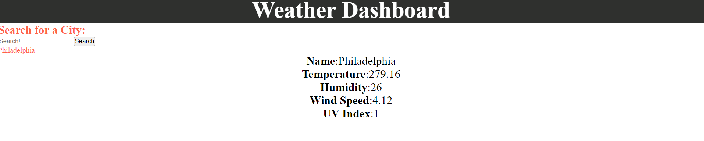

# Weather_Dashboard 

Here you will find a simple weather dashboard with information populated from an Openweathermap API. User can search any city and view the current temperature, humidity, wind speed and uv index as well as the weather forecast for the next five days. Users search results will also be saved on screen for quick reference of previous search history as well as in local storage. It's my hope that this handy weather dashboard will help you on your next vacation or traveling needs. Enjoy! 

 Deployed site: https://jess20005.github.io/Weather_Dashboard/
